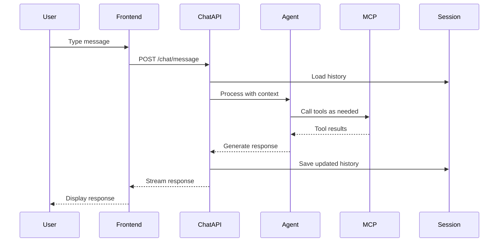

# Wilderness Assistant Chat Agent Architecture

**Project**: Luminari Wilderness Editor  
**Component**: AI Chat Assistant  
**Version**: 1.0  
**Status**: Planning/Documentation  
**Date**: December 2024  

## 🎯 Executive Summary

The Wilderness Assistant is an AI-powered chat agent that helps builders create and manage wilderness regions using natural language. It integrates with multiple MCP servers to access wilderness data, game lore, and provide intelligent assistance while maintaining consistency with the LuminariMUD game world.

## 🏗️ Architecture Overview

### System Components

```
┌─────────────────────────────────────────────────────────────┐
│                    Frontend (React)                          │
│  ┌─────────────────────────────────────────────────────────┐│
│  │              Chat Interface Component                    ││
│  │  ┌─────────────────────────────────────────────────────┐││
│  │  │ • Message History Display                           │││
│  │  │ • Streaming Response Support                        │││
│  │  │ • Tool Call Visualization                          │││
│  │  │ • Context Status Indicator                         │││
│  │  │ • Command Palette (/help, /context, etc.)         │││
│  │  └─────────────────────────────────────────────────────┘││
│  └─────────────────────────────────────────────────────────┘│
└────────────────────┬─────────────────────────────────────────┘
                     │ WebSocket/SSE Connection
┌────────────────────┴─────────────────────────────────────────┐
│              Chat Agent Service (Backend)                    │
│                    /apps/agent/                              │
│  ┌─────────────────────────────────────────────────────────┐│
│  │            PydanticAI Chat Agent Core                    ││
│  │  ┌─────────────────────────────────────────────────┐    ││
│  │  │ Components:                                      │    ││
│  │  │ • Agent Instance (GPT-4)                        │    ││
│  │  │ • Session Manager (Redis/PostgreSQL)            │    ││
│  │  │ • Context Processor                             │    ││
│  │  │ • Tool Orchestrator                             │    ││
│  │  │ • Response Streamer                             │    ││
│  │  └─────────────────────────────────────────────────┘    ││
│  └─────────────────────────────────────────────────────────┘│
│                         │                                    │
│  ┌──────────────┬───────┴────────┬──────────────────────┐   │
│  │              │                │                      │   │
│  ▼              ▼                ▼                      ▼   │
│ Wilderness    Sage MCP      Editor State          AI Model │
│ MCP Server    Server        Context               (GPT-4)  │
│ (Port 8001)   (Port 8002)   (Shared Memory)              │
└──────────────────────────────────────────────────────────────┘
```

## 📁 Project Structure

```
/apps/agent/
├── src/
│   ├── __init__.py
│   ├── main.py                    # FastAPI application entry
│   ├── config.py                  # Configuration management
│   │
│   ├── agent/
│   │   ├── __init__.py
│   │   ├── chat_agent.py          # Main PydanticAI agent
│   │   ├── tools.py               # Custom tool definitions
│   │   ├── prompts.py             # System prompts
│   │   └── context.py             # Context management
│   │
│   ├── session/
│   │   ├── __init__.py
│   │   ├── manager.py             # Session state management
│   │   ├── storage.py             # Redis/DB persistence
│   │   └── models.py              # Session data models
│   │
│   ├── routers/
│   │   ├── __init__.py
│   │   ├── chat.py                # Chat endpoints
│   │   ├── session.py             # Session management endpoints
│   │   └── health.py              # Health check endpoints
│   │
│   ├── schemas/
│   │   ├── __init__.py
│   │   ├── chat.py                # Request/response models
│   │   ├── session.py             # Session models
│   │   └── context.py             # Context models
│   │
│   ├── services/
│   │   ├── __init__.py
│   │   ├── mcp_client.py          # MCP server connections
│   │   ├── streaming.py           # Response streaming
│   │   └── validation.py          # Input validation
│   │
│   └── utils/
│       ├── __init__.py
│       ├── logger.py              # Logging configuration
│       └── metrics.py             # Performance metrics
│
├── tests/
│   ├── conftest.py
│   ├── test_agent.py
│   ├── test_session.py
│   └── test_integration.py
│
├── requirements.txt               # Python dependencies
├── Dockerfile                     # Container definition
├── docker-compose.yml            # Local development setup
└── README.md                     # Quick start guide
```

## 🔧 Core Components

### 1. Chat Agent (`agent/chat_agent.py`)

```python
from pydantic_ai import Agent
from pydantic_ai.models.openai import OpenAIModel
from pydantic_ai.mcp import MCPServerStdio, MCPServerHTTP

class WildernessAssistantAgent:
    """
    Main chat agent for wilderness building assistance.
    Integrates with multiple MCP servers and maintains conversation context.
    """
    
    def __init__(self, config: AgentConfig):
        # Initialize AI model
        self.model = OpenAIModel(
            model_name='gpt-4-turbo',
            api_key=config.openai_api_key
        )
        
        # Initialize MCP connections
        self.wilderness_mcp = MCPServerStdio(
            command="python",
            args=["-m", "wildeditor.mcp.server"],
            env={"MCP_MODE": "wilderness"}
        )
        
        self.sage_mcp = MCPServerHTTP(
            url=config.sage_mcp_url,
            headers={"X-API-Key": config.sage_api_key}
        )
        
        # Create agent with toolsets
        self.agent = Agent(
            model=self.model,
            toolsets=[self.wilderness_mcp, self.sage_mcp],
            instructions=self._load_system_prompt(),
            output_type=AssistantResponse
        )
    
    async def process_message(
        self, 
        message: str, 
        session_id: str,
        context: EditorContext
    ) -> AssistantResponse:
        """Process a user message with full context"""
        # Implementation details...
```

### 2. Session Manager (`session/manager.py`)

```python
from typing import Optional, List
from pydantic_ai.messages import ModelMessage
import redis.asyncio as redis

class SessionManager:
    """
    Manages conversation sessions and message history.
    Supports both Redis (production) and in-memory (development) storage.
    """
    
    def __init__(self, storage_backend: str = "redis"):
        self.storage = self._init_storage(storage_backend)
        self.ttl = 86400  # 24 hours
    
    async def save_session(
        self, 
        session_id: str, 
        messages: List[ModelMessage],
        metadata: SessionMetadata
    ):
        """Persist session state"""
        # Implementation details...
    
    async def load_session(
        self, 
        session_id: str
    ) -> Optional[SessionData]:
        """Retrieve session state"""
        # Implementation details...
    
    async def update_context(
        self,
        session_id: str,
        context: EditorContext
    ):
        """Update session with latest editor context"""
        # Implementation details...
```

### 3. Context Processor (`agent/context.py`)

```python
from dataclasses import dataclass
from typing import Optional, Dict, Any

@dataclass
class EditorContext:
    """Current editor state and context"""
    selected_region_id: Optional[int]
    selected_path_ids: List[int]
    viewport: ViewportState
    active_tool: str
    recent_actions: List[EditorAction]
    user_preferences: UserPreferences
    
    def to_prompt_context(self) -> str:
        """Convert context to prompt-friendly format"""
        # Implementation details...

class ContextProcessor:
    """
    Processes and enriches editor context for the agent.
    """
    
    async def enrich_context(
        self,
        base_context: EditorContext
    ) -> EnrichedContext:
        """
        Enrich basic context with additional information:
        - Fetch details of selected regions
        - Get nearby regions
        - Include recent changes
        - Add relevant lore connections
        """
        # Implementation details...
```

## 🔌 MCP Integration

### Wilderness MCP Tools

The agent will have access to all wilderness MCP tools:

```python
WILDERNESS_TOOLS = [
    "get_region",
    "create_region",
    "update_region",
    "delete_region",
    "list_regions",
    "search_regions",
    "get_paths",
    "create_path",
    "analyze_terrain",
    "generate_description",
    "generate_hints",
    "validate_connections"
]
```

### Sage MCP Tools (Future)

```python
SAGE_TOOLS = [
    "search_lore",
    "get_location_history",
    "check_consistency",
    "suggest_connections",
    "get_npc_info",
    "get_quest_info",
    "validate_lore_references"
]
```

## 🔄 Request/Response Flow

### 1. Chat Message Flow



### 2. Streaming Response Protocol

```typescript
// WebSocket message types
interface ChatMessage {
  type: 'user' | 'assistant' | 'tool_call' | 'error';
  content: string;
  metadata?: {
    tool?: string;
    args?: any;
    result?: any;
    timestamp?: string;
  };
}

interface StreamChunk {
  type: 'text' | 'tool_start' | 'tool_end' | 'complete';
  data: string | ToolCallData;
  delta?: string;  // For incremental text
}
```

## 📡 API Endpoints

### Core Chat Endpoints

```yaml
/api/agent/chat:
  post:
    summary: Send message to assistant
    requestBody:
      content:
        application/json:
          schema:
            type: object
            properties:
              message: string
              session_id: string
              context: EditorContext
    responses:
      200:
        description: Streaming response via SSE/WebSocket

/api/agent/session/{session_id}:
  get:
    summary: Get session history
    responses:
      200:
        description: Session data with message history
  
  delete:
    summary: Clear session
    responses:
      204:
        description: Session cleared

/api/agent/context:
  post:
    summary: Update session context
    requestBody:
      content:
        application/json:
          schema:
            $ref: '#/components/schemas/EditorContext'
```

## 💬 Example Interactions

### Example 1: Region Creation with Lore

```
User: "Create a mystical forest at 150,200 that connects to the 
      Elven Sanctuary. It should have ancient ruins from the 
      First Age."