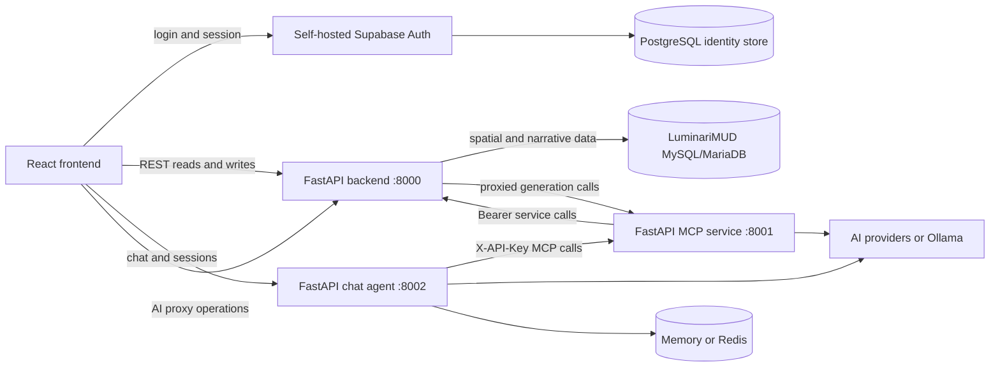

# Architecture

Wildeditor is a monorepo with four independently deployed applications and two shared packages. The browser editor and backend are the core path; MCP and the chat agent add AI-assisted workflows without bypassing the backend's data boundary.

## Runtime topology

The backend-to-MCP edge exists for browser-facing AI proxy routes. The agent still obtains application data only through MCP; it must not gain a direct backend or database client.

## Component ownership

| Component | Entry point | Owns | Does not own |
| --- | --- | --- | --- |
| Frontend | `apps/frontend/src/main.tsx` | UI state, drawing tools, local drafts, API-to-UI conversion | Durable wilderness data or server secrets |
| Backend | `apps/backend/src/main.py` as `src.main:app` | REST contracts, validation, MySQL access, spatial serialization | Chat sessions or MCP protocol |
| MCP | `apps/mcp/src/main.py` as `src.main:app` | MCP JSON-RPC facade, tools, resources, prompts, AI generation | Direct database access |
| Chat agent | `apps/agent/src/main.py` as `src.main:app` | Conversation orchestration and TTL-bound session state | Direct backend/database access |
| Shared TypeScript | `packages/shared/src/` | Reusable frontend domain contracts | Wire-format conversion |
| Shared auth | `packages/auth/src/wildeditor_auth/` | Typed principals, human JWT verification, Bearer service authentication, and MCP API-key middleware | Application route policy |

## Data ownership

MySQL/MariaDB is authoritative for wilderness application data. The backend maps these tables through SQLAlchemy/GeoAlchemy:

- `region_data`: region geometry, type, properties, descriptions, and review metadata
- `path_data`: path geometry, type, and properties
- `region_hints`: categorized region hints
- `region_profiles`: per-region narrative profiles
- `hint_usage_log`: optional hint-use analytics

Self-hosted Supabase Auth and its dedicated PostgreSQL database are authoritative
only for users, identities, credentials, refresh tokens, and MFA state. They
are not wilderness datastores. Chat sessions are TTL-bound and live in Redis
in production or process memory in explicit local development.

This split is intentional. LuminariMUD depends on MariaDB-specific schema,
spatial routines, and triggers; PostgreSQL Auth supplies identity behavior that
should not be reimplemented in the application. See
[ADR-003](adr/003-hybrid-datastores-and-self-hosted-auth.md).

## Contracts and adapters

- Backend request/response shapes live in `apps/backend/src/schemas/`.
- Backend persistence mappings live in `apps/backend/src/models/`.
- Reusable UI domain types live in `packages/shared/`.
- `apps/frontend/src/services/api.ts` converts backend wire values into UI-ready objects and back.
- MCP tools call backend REST endpoints; they do not import backend models or open database connections.
- The chat agent calls `apps/agent/src/services/mcp_client.py`; it does not call the backend directly.

An API-shape change therefore normally requires coordinated schema, router, frontend adapter/type, MCP caller, and focused test updates.

## Authentication boundaries

- The frontend uses one self-hosted Supabase Auth provider and sends the current
  human access token to backend and chat APIs.
- Backend and chat validate the JWT signature, asymmetric algorithm, exact
  issuer, audience, expiration, subject, and protected role. Backend routes enforce
  viewer/editor/admin roles. MCP-to-backend uses a distinct server-only Bearer
  service principal.
- MCP operations use `X-API-Key` with `WILDEDITOR_MCP_KEY`; agent calls remain
  agent-to-MCP-to-backend and carry trusted audit context.
- Chat requires editor/admin JWTs and binds every session to the authenticated
  token subject.
- The service role is server-only and cannot be asserted by a human JWT.
- No backend, MCP, database, signing, or Auth administrative secret is compiled
  into browser assets.

Deployment, recovery, role administration, and key rotation are documented in
the [self-hosted Auth runbook](operations/self-hosted-auth-runbook.md).

## Persistence and migrations

The LuminariMUD MySQL/MariaDB schema is an integration contract. Add changes as new migrations beside the owning datastore; do not rewrite applied migrations. `apps/backend/migrations/002_add_region_hints_tables.sql` is the only backend-owned migration currently present. The `supabase/migrations/` directory belongs to the separate Supabase/PostgreSQL datastore and must not be mixed with MySQL migrations.

## Deployment boundaries

Each Python service has its own Dockerfile and health check. Frontend, backend, MCP, and chat deployments are driven by separate workflows under `.github/workflows/`. Root Compose and deployment files are retained for compatibility and experimentation, but their behavior must be verified before use; the service Dockerfiles and workflows are authoritative.
