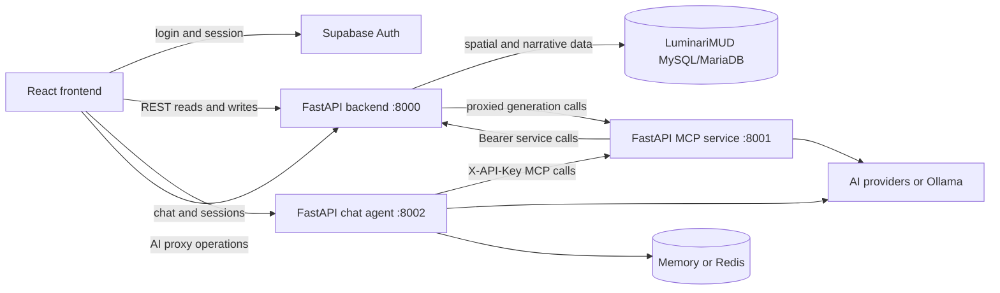

# Architecture

Wildeditor is a monorepo with four independently deployed applications and two shared packages. The browser editor and backend are the core path; MCP and the chat agent add AI-assisted workflows without bypassing the backend's data boundary.

## Runtime topology

The backend-to-MCP edge exists for browser-facing AI proxy routes. The agent still obtains application data only through MCP; it must not gain a direct backend or database client.

## Component ownership

| Component | Entry point | Owns | Does not own |
| --- | --- | --- | --- |
| Frontend | `apps/frontend/src/main.tsx` | UI state, drawing tools, local drafts, API-to-UI conversion | Durable wilderness data or server secrets |
| Backend | `apps/backend/src/main.py` as `src.main:app` | REST contracts, validation, MySQL access, spatial serialization | Chat sessions or MCP protocol |
| MCP | `apps/mcp/src/main.py` as `src.main:app` | MCP JSON-RPC facade, tools, resources, prompts, AI generation | Direct database access |
| Chat agent | `apps/agent/src/main.py` as `src.main:app` | Conversation orchestration and TTL-bound session state | Direct backend/database access |
| Shared TypeScript | `packages/shared/src/` | Reusable frontend domain contracts | Wire-format conversion |
| Shared auth | `packages/auth/src/wildeditor_auth/` | MCP API-key middleware and dependencies | Human browser authentication |

## Data ownership

MySQL/MariaDB is authoritative for wilderness application data. The backend maps these tables through SQLAlchemy/GeoAlchemy:

- `region_data`: region geometry, type, properties, descriptions, and review metadata
- `path_data`: path geometry, type, and properties
- `region_hints`: categorized region hints
- `region_profiles`: per-region narrative profiles
- `hint_usage_log`: optional hint-use analytics

Supabase is currently used by the browser for authentication, not as the wilderness datastore. Chat sessions are ephemeral and live in process memory by default or Redis when `STORAGE_BACKEND=redis`.

## Contracts and adapters

- Backend request/response shapes live in `apps/backend/src/schemas/`.
- Backend persistence mappings live in `apps/backend/src/models/`.
- Reusable UI domain types live in `packages/shared/`.
- `apps/frontend/src/services/api.ts` converts backend wire values into UI-ready objects and back.
- MCP tools call backend REST endpoints; they do not import backend models or open database connections.
- The chat agent calls `apps/agent/src/services/mcp_client.py`; it does not call the backend directly.

An API-shape change therefore normally requires coordinated schema, router, frontend adapter/type, MCP caller, and focused test updates.

## Authentication boundaries

Current behavior is transitional:

- Backend region/path mutations use `Authorization: Bearer <WILDEDITOR_API_KEY>` when `REQUIRE_AUTH` is enabled. Most reads are public.
- MCP operations use `X-API-Key` with `WILDEDITOR_MCP_KEY`. MCP-to-backend calls use the backend Bearer key.
- The frontend uses Supabase Auth for UI access, but backend routes do not validate Supabase JWTs as human principals.
- The frontend currently compiles `VITE_WILDEDITOR_API_KEY` into browser assets for mutations. A `VITE_` value is public and must not be treated as a production secret.
- Chat routes currently have no user-authentication dependency or session-ownership enforcement.

These limitations are why the repository is marked pre-release. The proposed target and its acceptance gates are documented in the [self-hosted authentication migration plan](ongoing-projects/self-hosted-postgres-auth-migration-plan.md).

## Persistence and migrations

The LuminariMUD MySQL/MariaDB schema is an integration contract. Add changes as new migrations beside the owning datastore; do not rewrite applied migrations. `apps/backend/migrations/002_add_region_hints_tables.sql` is the only backend-owned migration currently present. The `supabase/migrations/` directory belongs to the separate Supabase/PostgreSQL datastore and must not be mixed with MySQL migrations.

## Deployment boundaries

Each Python service has its own Dockerfile and health check. Frontend, backend, MCP, and chat deployments are driven by separate workflows under `.github/workflows/`. Root Compose and deployment files are retained for compatibility and experimentation, but their behavior must be verified before use; the service Dockerfiles and workflows are authoritative.
