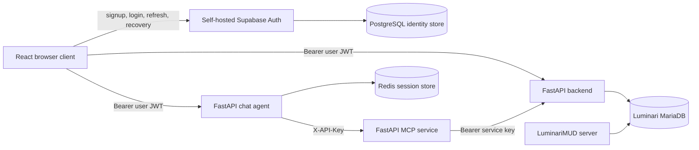

# Self-hosted PostgreSQL authentication migration plan

Status: implemented and validated locally; production cutover blocked on the
recorded source-user, SMTP, role-map, recovery-owner, and backup-recipient
inputs in `docs/operations/self-hosted-auth-runbook.md`

Last updated: 2026-08-05

Applies to: Wildeditor and its integration with LuminariMUD

Supersedes: the idea of moving the shared wilderness datastore from MariaDB to PostgreSQL

Implementation evidence as of 2026-08-05:

- The official pinned self-hosted stack and Auth-only loopback gateway are in
  `infrastructure/supabase/`; PostgreSQL has no public host port.
- The disposable full drill proves confirmation, protected role claims, login,
  refresh, logout/revocation, recovery/password update, backup, clean database
  replacement, ownership/ACL restoration, reconciliation, and post-restore
  login. CI repeats that drill.
- Backend, MCP, chat, and frontend use typed JWT/service principals, enforce the
  authorization matrix and chat ownership, and do not ship a backend/MCP
  credential in browser assets.
- A real ES256 editor token issued by the disposable self-hosted stack was
  accepted by the rebuilt backend and chat images, anonymous calls were
  rejected, and the Redis session owner matched the token subject.
- The rebuilt production images were also run with the production-equivalent
  private host-network topology: backend service authentication, MCP-to-backend
  readiness, and chat-to-Redis/MCP readiness all passed over loopback.
- The MariaDB CI gate builds the pinned LuminariMUD source from a clean archive,
  runs the real game twice, verifies its runtime-owned table and triggers, runs
  Wildeditor region/path/spatial/hint/profile operations, and proves the game
  can boot while consuming the resulting region and path fixtures.
- Production deployment is deliberately manual-gated and will refuse to run
  without real SMTP configuration, an `age` backup recipient, and the remaining
  production secrets. No production cutover has been performed.

## Decision

Keep MariaDB as the canonical datastore for all LuminariMUD game, wilderness, spatial, and narrative data. Replace the managed Supabase dependency with a self-hosted Supabase Auth deployment backed by a dedicated open-source PostgreSQL database.

PostgreSQL will be the authoritative identity store, not a second copy of the game datastore. Redis or in-memory storage will remain responsible for ephemeral chat sessions.

This is a hybrid database architecture by design:

| Concern | Authoritative store | Reason |
| --- | --- | --- |
| Wilderness regions, paths, indexes, hints, profiles, and usage | MariaDB | LuminariMUD creates, loads, queries, and mutates these tables through the MariaDB C API and MariaDB-specific spatial SQL, functions, and triggers. |
| Wildeditor users, identities, credentials, refresh tokens, and MFA state | PostgreSQL through self-hosted Supabase Auth | The current frontend already uses Supabase Auth, whose open-source Auth service persists identity state in PostgreSQL. |
| Chat conversation sessions | Redis in production; memory in development | These records are TTL-bound operational state, not durable game or identity data. |

Do not introduce PostGIS replicas, dual writes, cross-database foreign keys, or synchronization jobs for MariaDB game tables.

## Why the original all-PostgreSQL direction is unsafe

The current repositories make MariaDB part of the LuminariMUD runtime contract, not an interchangeable Wildeditor implementation detail:

- `Luminari-Source/AGENTS.md` states that MySQL/MariaDB is required for the server to run.
- `Luminari-Source/src/db_init.c` creates `region_data`, `path_data`, `path_types`, `region_index`, `path_index`, `region_hints`, `region_profiles`, `hint_usage_log`, and `description_templates` with MariaDB types and syntax.
- The same file installs MariaDB stored routines and triggers that digitize path geometries and maintain the spatial index tables.
- `Luminari-Source/src/mysql.c` loads `region_data` and `path_data` directly into the live game process with MariaDB spatial functions such as `ST_ExteriorRing`, `ST_NumPoints`, and `ST_AsText`.
- `Luminari-Source/src/wilderness/region_hints.c` reads hint/profile data and writes usage records directly to MariaDB.
- `Luminari-Source/src/db_init_data.c` explicitly identifies Wildeditor as the manager of the shared region and path tables.
- Wildeditor's backend maps and queries the same tables in `apps/backend/src/models/`, `apps/backend/src/routers/regions.py`, `apps/backend/src/routers/paths.py`, `apps/backend/src/routers/points.py`, and `apps/backend/src/routers/region_hints.py`.

Moving those tables to PostgreSQL would require either a broad LuminariMUD database-porting project or a second source of truth with synchronization and failure modes. Neither belongs in this migration.

## What is actually in Supabase today

Repository usage is limited to authentication:

- `apps/frontend/src/lib/supabase.ts` creates the Supabase client.
- `apps/frontend/src/hooks/useAuth.ts` uses `supabase.auth` for session discovery, signup, password login, logout, and password recovery.
- No source code uses Supabase Data API queries, Storage, Realtime, channels, or RPC calls.
- The backend, MCP service, and chat agent have no live Supabase database integration.

Therefore, there is no application-data migration from Supabase to design. The migration is an Auth database and Auth service move from managed Supabase to self-hosted PostgreSQL.

PostgreSQL alone is not an authentication service. It can store password hashes and session records, but it does not implement secure password handling, refresh-token rotation, email confirmation, account recovery, OAuth callbacks, or JWT issuance. The recommended deployment keeps the open-source Supabase Auth service (GoTrue) in front of PostgreSQL rather than reimplementing those security-sensitive features in FastAPI.

## Authentication gaps addressed by the implementation

The migration repairs the authorization boundary rather than only changing the Supabase URL. The original gaps were:

1. Supabase currently gates the React UI, but the backend does not validate Supabase access tokens.
2. `apps/frontend/src/services/api.ts` sends `VITE_WILDEDITOR_API_KEY` for mutations. A Vite variable is compiled into public browser assets and cannot be treated as a secret.
3. `apps/frontend/src/components/RegionTabbedPanel.tsx` independently reads and sends that browser-exposed API key.
4. Several region-hint mutation routes have no authentication dependency.
5. The chat agent's session, history, and message routes accept no user authentication and do not bind a session to the authenticated user.
6. Backend service keys and human access tokens both use Bearer authentication, but the code has no principal model that distinguishes them.
7. `apps/frontend/src/lib/supabase.ts` flags self-hosted URLs that do not contain `supabase.co` as configuration errors.
8. Signup and recovery redirects are hard-coded in `apps/frontend/src/hooks/useAuth.ts`.
9. `.github/workflows/ci.yml` currently treats a compiled `supabase.co` URL as an expected production condition.

These code-level blockers are covered by the implementation and focused tests.
The separate production-data and operator gates remain recorded in the runbook.

## Target architecture



### Trust boundaries

- The browser receives only the Auth publishable key and user tokens. It never receives a backend, MCP, database, JWT-signing, or Auth administrative secret.
- Browser-facing backend and agent endpoints validate the JWT signature, allowed algorithm, issuer, audience, expiration, subject, and authorization claims.
- JWT verification uses the self-hosted Auth JWKS endpoint with a bounded cache. Auth is not placed in the hot path of every API request.
- MCP requests continue to use `X-API-Key` as required by the existing service boundary.
- MCP-to-backend requests continue to use Bearer authentication, but with a new server-only service key that is distinct from the key previously exposed to the browser.
- The agent continues to reach game data through MCP; no direct agent-to-backend or agent-to-MariaDB path is added.
- The chat agent authorizes tool classes from the verified human principal before it calls MCP. Verified actor and request identifiers travel only as trusted internal audit context, never as caller-supplied request-body fields.
- PostgreSQL is not exposed to the public internet. Auth is exposed through TLS and a reverse proxy; database and administrative ports remain on a private network.

## Recommended identity product choice

| Option | Application change | Operations | Migration fit | Decision |
| --- | --- | --- | --- | --- |
| Self-hosted Supabase Auth plus PostgreSQL | Low: retain `@supabase/supabase-js` and existing email/password flows | Moderate: operate Auth, PostgreSQL, SMTP, backups, TLS, and upgrades | Supabase Auth tables and password hashes can be restored directly | Recommended |
| OIDC provider such as Keycloak backed by PostgreSQL | High: replace the client integration, callbacks, token claims, admin workflows, and user migration | Moderate to high | Useful only if organization-wide SSO or vendor-neutral OIDC is a near-term requirement | Defer |
| Bespoke FastAPI auth tables in PostgreSQL | Very high security and maintenance burden | Superficially low, operationally risky | Requires rebuilding mature authentication behavior | Reject |

Start from Supabase's supported self-hosted Docker deployment, pin every image version or digest, and prove the full deployment in staging. After it is stable, remove unneeded services such as Storage, Realtime, Edge Runtime, and image processing if the supported Compose dependency graph permits it. Do not begin with an unverified hand-assembled Auth-only stack.

## Scope

### Included

- A self-hosted Supabase Auth and PostgreSQL deployment for development, staging, and production.
- Migration of managed Supabase Auth users and related Auth schema records.
- JWT authentication and role authorization in the backend and chat agent.
- User ownership for chat sessions and history.
- Removal and rotation of the backend key currently included in frontend builds.
- Continued server-to-server authentication for agent to MCP and MCP to backend.
- Auth configuration for SMTP, email verification, password recovery, redirects, token lifetime, signing keys, and signup policy.
- PostgreSQL backups, restore drills, monitoring, upgrades, and incident runbooks.
- CI, deployment workflow, environment example, and focused test updates.
- A MariaDB compatibility gate proving that the game datastore is unchanged.

### Excluded

- Porting LuminariMUD from MariaDB to PostgreSQL.
- Moving or replicating wilderness data to PostGIS.
- Replacing Redis with PostgreSQL.
- Redesigning the frontend outside the authentication flow.
- Adding a direct chat-agent-to-backend path.
- General cleanup of legacy database or deployment code.

## Data ownership and schema policy

### MariaDB remains authoritative

Keep the following objects in the LuminariMUD MariaDB database:

- `region_data`
- `path_data`
- `path_types`
- `region_index`
- `path_index`
- `region_hints`
- `region_profiles`
- `hint_usage_log`
- `description_templates`
- related spatial functions, digitization routines, views, and maintenance triggers

Treat the LuminariMUD source and its owning migrations/initializers as the schema authority. Wildeditor SQLAlchemy models are compatibility mappings, not an independent schema definition. Before implementation, record and resolve any contract drift among `Luminari-Source/src/db_init.c`, `Luminari-Source/sql/`, Wildeditor models, and `apps/backend/migrations/` through new owning migrations; do not rewrite old migrations.

### PostgreSQL owns identity only

Supabase Auth owns its internal `auth` schema, including users, identities, sessions, refresh tokens, factors, and flow state. Application code must not directly mutate those internal tables.

For the initial migration, store the Wildeditor authorization role in protected Auth `app_metadata`, managed only through an administrative API or controlled migration. Use these roles:

- `viewer`: read-only editor and terrain access
- `editor`: read and mutate wilderness content and use AI-assisted editing
- `admin`: editor permissions plus user/role administration
- `service`: non-human MCP-to-backend principal represented by a server-side key, not a Supabase user

Migrate every existing active user as `editor` unless an explicit review says otherwise. Use invite-only signup at cutover unless open public editing is an intentional product decision.

If zone-scoped or organization-scoped authorization becomes a real requirement, add a versioned `public.editor_memberships` table and a custom access-token hook in a later change. At that point:

- Enable and force row-level security.
- Revoke default `public`, `anon`, and `authenticated` access unless specifically needed.
- Grant only the Auth hook role the minimum required permissions.
- Index foreign-key columns.
- Use connection pooling for any application access.

Do not add that table preemptively just to reproduce the current all-or-nothing access model.

## Authorization policy

The shared Python auth package should return a typed principal rather than a boolean. A principal contains at least `kind`, `subject`, `role`, `issuer`, and optional email; logs use the subject identifier and never record tokens.

| Surface | Anonymous | `viewer` | `editor` | `admin` | `service` |
| --- | --- | --- | --- | --- | --- |
| Health/readiness | Allow | Allow | Allow | Allow | Allow |
| Auth callback and login UI | Allow | N/A | N/A | N/A | N/A |
| Region/path/point/terrain reads | Deny | Allow | Allow | Allow | Allow |
| Region/path mutations | Deny | Deny | Allow | Allow | Allow |
| Hint/profile reads | Deny | Allow | Allow | Allow | Allow |
| Hint/profile generation or mutation | Deny | Deny | Allow | Allow | Allow |
| Backend MCP proxy invoked by the UI | Deny | Deny | Allow | Allow | Deny unless explicitly required |
| Chat session/message/history routes | Deny | Deny | Allow | Allow | Deny |
| User and role administration | Deny | Deny | Deny | Allow | Dedicated admin automation only |

Every chat session is created with the authenticated JWT `sub`. Loading, extending, updating, clearing, or deleting a session must verify the same owner. A caller-supplied `user_id` must not override the authenticated identity.

## Implementation plan

### Phase 0 - Inventory and freeze the contract

Tasks:

1. Inventory the managed Supabase project without exporting secrets or personal data into logs:
   - Auth user, identity, session, refresh-token, and MFA row counts.
   - Enabled login providers.
   - Email-confirmation and signup policy.
   - Custom claims, hooks, templates, redirect allow-list, and token lifetime.
   - PostgreSQL and Auth service versions and installed extensions.
   - Any non-Auth schemas or data not visible in this repository.
2. Record the current MariaDB engine/version and compare the live wilderness schema with the LuminariMUD initializers and Wildeditor mappings.
3. Decide and document:
   - Production Auth hostname, recommended as `auth.wildedit.luminarimud.com`.
   - Invite-only versus public signup; invite-only is the default recommendation.
   - Which existing users are `viewer`, `editor`, or `admin`.
   - PostgreSQL recovery point and recovery time objectives.
   - The production SMTP provider and sender domain.
   - The rollback observation window; seven days is the initial recommendation.
4. Freeze Auth schema/configuration changes between the final rehearsal and production cutover.

Exit gate:

- The source inventory, role mapping, target versions, hostname, SMTP path, backup targets, and rollback owner are recorded in the cutover runbook.
- Any unexpected Supabase Data API, Storage, Realtime, or custom-schema usage is either brought into scope explicitly or proven unused.

### Phase 1 - Make hosted Auth authoritative before moving it

Separate authentication correctness from infrastructure migration. First make the application trust the existing managed Supabase JWT end to end.

Tasks:

1. Extend `packages/auth` with:
   - A typed human/service principal.
   - JWT verification using a pinned allow-list of asymmetric algorithms and cached JWKS.
   - Exact issuer, audience, expiration, and subject checks.
   - Role extraction only from protected claims, never user-editable metadata.
   - Constant-time service-key comparison.
   - Explicit 401 versus 403 errors.
2. Make the backend and chat-agent Docker builds install `packages/auth`.
3. Replace the backend's boolean API-key dependency with a principal dependency that accepts:
   - A valid human JWT in `Authorization: Bearer`.
   - The current server-only backend service credential in the same Bearer convention for MCP calls.
4. Configure the managed project to issue the reviewed protected `app_role` claim and apply the approved signup policy before API enforcement is enabled.
5. Apply the authorization matrix to every backend router, including region-hint and MCP-proxy routes.
6. Require an `editor` or `admin` JWT on chat routes, enforce session ownership, and authorize each MCP tool class before invocation.
7. Carry the verified human actor subject and request ID through the agent/MCP chain as internal audit context without weakening either service-key boundary.
8. Centralize frontend auth state in one provider so the app does not create independent Supabase subscriptions from each `useAuth()` call.
9. Send the user's access token on all protected backend and chat requests, including streaming requests.
10. Remove `VITE_WILDEDITOR_API_KEY` from frontend code, examples, Netlify configuration, and build workflows.
11. Replace the independent authenticated fetch in `RegionTabbedPanel.tsx` with the typed API adapter.
12. Give MCP a new backend-only credential, update MCP-to-backend Bearer requests, then revoke the credential that has appeared in browser builds.
13. Make signup, confirmation, recovery, and application redirect URLs environment-driven.

Exit gate:

- The application works against managed Supabase Auth with no backend service secret in the browser bundle.
- Missing/invalid tokens receive 401; valid users without a required role receive 403.
- MCP can still call the backend, and the agent still calls only MCP for game data.
- Chat sessions cannot be read or mutated by another authenticated user.

### Phase 2 - Provision self-hosted Auth and PostgreSQL

Tasks:

1. Add a version-pinned, production-oriented self-hosted Supabase deployment definition and environment template. Keep secrets out of the repository.
2. Provision separate PostgreSQL databases or clusters for development, staging, and production. Do not share the LuminariMUD MariaDB volume, credentials, or lifecycle.
3. Put Auth and its API gateway behind TLS. Keep PostgreSQL, Studio, pooler administration, and metrics endpoints private.
4. Configure:
   - Public Auth URL and external API URL.
   - Exact production callback and recovery redirects plus explicit local/staging entries.
   - SMTP host, credentials, sender, templates, and delivery monitoring.
   - Signup and email-confirmation policy.
   - Asymmetric JWT signing keys and documented rotation.
   - Token lifetime and refresh-token behavior.
   - Rate limits and abuse controls.
5. Use least-privilege PostgreSQL roles. Do not use a superuser connection for application queries.
6. Use the supplied connection pooler for services that need PostgreSQL access; do not expose direct PostgreSQL connections publicly.
7. Configure durable volumes, encrypted backups, backup-age alerts, disk/capacity alerts, and a documented restore command.
8. Establish an upgrade procedure that rehearses Auth image and PostgreSQL version compatibility in staging before production.
9. Start with the supported Compose stack. Remove unused services only after the reduced stack passes startup, health, signup, login, refresh, recovery, and restore tests.

Exit gate:

- Staging supports invite/signup, email confirmation, password login, refresh, logout, recovery, and role claims.
- A backup has been restored into a clean staging environment and the restored Auth instance passes the same flow tests.
- PostgreSQL is unreachable from the public network.

### Phase 3 - Rehearse the Auth data migration

Tasks:

1. Create source backups using the supported Supabase CLI/export procedure. Include roles, schema, and data required by the Auth service.
2. Match the self-hosted PostgreSQL and Auth versions to the source where practical. Resolve version-specific schema differences in a repeatable migration script kept under version control; never hand-edit production only.
3. Restore into an empty rehearsal instance in a single transaction after all known incompatibilities are resolved.
4. Preserve `auth.users`, identities, password hashes, confirmation state, provider metadata, MFA records, and stable user UUIDs.
5. Apply the reviewed Wildeditor role mapping through a controlled administrative step.
6. Treat old access and refresh tokens as invalid at cutover. Do not copy signing secrets merely to avoid asking users to sign in again.
7. Verify without logging personal data:
   - Per-table source and target row counts.
   - A deterministic aggregate/checksum over stable non-secret identifiers.
   - Password login for designated test accounts.
   - Confirmation, recovery, refresh, logout, and each configured OAuth provider.
   - Role claims and 401/403 behavior in backend and chat APIs.
8. Time the final export, restore, verification, DNS/config switch, and rollback steps.
9. Produce a command-by-command cutover and rollback runbook with named decision points.

Exit gate:

- Two clean rehearsal restores succeed from the same scripted process.
- Counts and safe aggregates reconcile, test users can authenticate, and the full application authorization suite passes.
- The measured maintenance window and rollback threshold are documented.

### Phase 4 - Production cutover

Deployment order matters:

1. Deploy backend and chat services that can validate both the managed and self-hosted Auth issuers. Continue validating all claims separately for each issuer; never accept an arbitrary issuer from the token.
2. Deploy the new server-only MCP-to-backend credential and verify service calls.
3. Enter the short Auth maintenance window. Disable signup and account changes in the source project and prevent frontend writes that would create identity divergence.
4. Take the final source backup, restore it to production PostgreSQL, apply roles, and run reconciliation checks.
5. Switch frontend public Auth URL/key and exact redirect configuration to the self-hosted endpoint.
6. Require users to sign in again because the self-hosted instance has new signing keys.
7. Run smoke tests for login, refresh, recovery, editor reads/writes, hint operations, chat ownership, agent-to-MCP, MCP-to-backend, and LuminariMUD region/path loading.
8. End the maintenance window only after all smoke and reconciliation gates pass.
9. Monitor Auth errors, login failures, SMTP delivery, PostgreSQL health, API 401/403/5xx rates, and MariaDB error rates continuously during the initial observation period.

Rollback during the observation window:

- Switch the frontend back to the managed Auth URL/key.
- Keep dual-issuer backend support active.
- Restore the prior deployment artifacts, not locally rebuilt approximations.
- Reconcile or explicitly discard identity changes made after cutover; do not dual-write Auth state.
- MariaDB game data requires no rollback because this migration does not move or alter it.

Exit gate:

- Production has remained healthy for the approved observation period, and no unreconciled user or authorization failures remain.

### Phase 5 - Retire managed Supabase and harden operations

Tasks:

1. Remove the managed issuer and JWKS URL from backend and agent trust configuration.
2. Remove old Supabase URL/key secrets from Netlify, GitHub Actions, hosts, and developer environment examples.
3. Revoke the former browser-exposed backend credential and any transition-only service credentials.
4. Confirm production assets contain no `*.supabase.co` endpoint and no backend/MCP secret.
5. Take a final managed-project backup, store it according to the retention policy, then decommission the managed project.
6. Run and record a production-like PostgreSQL restore drill.
7. Add recurring procedures for:
   - PostgreSQL and Auth upgrades.
   - Signing-key and service-key rotation.
   - Backup verification and restore drills.
   - User invitation, suspension, role change, and deletion.
   - Auth or SMTP incident response.
8. Update operational documentation to describe MariaDB as the game-data authority and PostgreSQL as the identity authority.

Exit gate:

- There is no runtime dependency on managed Supabase.
- Recovery, upgrade, key-rotation, and user-administration runbooks have been exercised by someone other than their author.

## Expected implementation touchpoints

### Frontend

- `apps/frontend/src/lib/supabase.ts`
- `apps/frontend/src/hooks/useAuth.ts`
- a new centralized Auth provider/context
- `apps/frontend/src/services/api.ts`
- `apps/frontend/src/services/chatAPI.ts`
- `apps/frontend/src/components/RegionTabbedPanel.tsx`
- auth callback and password-recovery routes/components
- `apps/frontend/src/vite-env.d.ts`
- frontend `.env*.example`, `netlify.toml`, and package manifest as needed

### Shared auth and Python services

- `packages/auth/src/wildeditor_auth/` and focused tests
- `apps/backend/src/middleware/auth.py`
- every protected backend router
- backend requirements, Dockerfile, environment example, and tests
- chat-agent requirements, Dockerfile, configuration, routers, session manager, and tests
- MCP configuration and backend caller for the rotated server-only credential

### Operations and CI

- a dedicated self-hosted Auth deployment directory with pinned Compose inputs
- PostgreSQL/Auth initialization migrations only for application-owned additions
- `.github/workflows/ci.yml`
- backend, MCP, and agent deployment workflows where environment contracts change
- backup, restore, cutover, rollback, upgrade, and key-rotation runbooks

## Validation plan

### Automated authentication tests

Add focused tests for:

- Valid user JWT for each role.
- Expired, not-yet-valid, malformed, and incorrectly signed tokens.
- Wrong issuer, audience, algorithm, or missing subject.
- JWKS refresh and bounded-cache behavior during key rotation.
- Valid and invalid service keys using constant-time comparison.
- 401 versus 403 behavior for every router class.
- Region-hint mutations, backend MCP proxy, and chat routes, which currently have coverage gaps.
- Chat session ownership and caller-supplied `user_id` rejection.
- Viewer denial for chat/tool calls and actor-context propagation for editor/admin tool calls.
- Frontend token refresh and token propagation to REST, SSE, and callback flows.

Use locally generated test signing keys and a local JWKS fixture. Unit suites must not depend on a live managed Supabase project or production credentials.

### Self-hosted integration tests

Against an ephemeral or isolated staging stack, exercise:

1. Invite/signup and email confirmation.
2. Password login and session refresh.
3. Logout and refresh-token rejection.
4. Password recovery and update.
5. Role claim issuance and role changes after token refresh.
6. Backend read/write authorization.
7. Chat session ownership.
8. Backup and clean restore followed by another login.

### MariaDB compatibility tests

- Start a supported MariaDB instance initialized from the current LuminariMUD schema authority.
- Run Wildeditor region, path, point/spatial, hint, profile, and usage-log operations against it.
- Verify the path digitization and spatial-index maintenance triggers still execute.
- Run the relevant LuminariMUD test/boot smoke that loads regions, paths, hints, and profiles.
- Assert that no PostgreSQL/PostGIS connection is needed for game-data operations.

### Existing repository checks

Run the smallest relevant checks from the Wildeditor repository root:

```bash
npm run lint
npm run type-check
npm run build

PYTHONPATH=packages/auth/src python -m pytest -q packages/auth/tests
(cd apps/backend && PYTHONPATH=. python -m pytest tests/ -m "not integration" --tb=short)
(cd apps/mcp && PYTHONPATH=. python -m pytest tests/ --tb=short)
```

Add an agent-local focused suite for JWT and session ownership before relying on the chat service in production. Do not treat the root `npm test` placeholder as meaningful coverage, and do not use credential-dependent root probes as CI evidence.

### Build-artifact and secret gates

- Fail CI if frontend source or built assets contain `VITE_WILDEDITOR_API_KEY` or a known backend/MCP credential.
- Permit only the Auth publishable key in frontend assets; explicitly document that it is public.
- After cutover, fail CI if built assets contain a configured
  `https://<project-ref>.supabase.co` endpoint or the retired managed project
  identifier. The Supabase client itself embeds a literal `*.supabase.co`
  compatibility pattern, so that vendor string is not evidence of app
  configuration.
- Scan logs and error responses to ensure tokens, database URLs, API keys, password hashes, and SMTP credentials are redacted.

## Acceptance criteria

The migration is complete only when all of the following are proven:

- LuminariMUD and Wildeditor continue to use the same MariaDB wilderness tables and spatial behavior; none of those tables has moved or been replicated to PostgreSQL.
- Existing active users are present in the self-hosted Auth database with stable IDs, usable password hashes or a documented recovery path, confirmation state, identities, and reviewed roles.
- Signup/invite, confirmation, login, refresh, logout, and password recovery work through the self-hosted endpoint.
- Backend and chat APIs validate self-hosted JWTs and enforce the authorization matrix.
- Every chat session is owned by and accessible only to its authenticated user.
- Viewers cannot invoke chat tools, and human-triggered agent mutations retain trusted actor and request context through MCP for audit.
- The browser contains no backend, MCP, database, JWT-signing, or Auth administrative secret.
- Agent-to-MCP and MCP-to-backend authentication continues to work with server-only keys and the required service boundary.
- Production PostgreSQL is private, backed up, monitored, and successfully restored in a recorded drill.
- CI covers negative token cases, protected-route behavior, chat ownership, the self-hosted Auth flow, and MariaDB compatibility.
- Managed `*.supabase.co` configuration and trust are removed after the rollback window.
- Operational owners can perform upgrades, restore, signing-key rotation, service-key rotation, and user administration from tested runbooks.

## Risks and mitigations

| Risk | Mitigation |
| --- | --- |
| Self-hosting adds database and Auth operations work | Pin versions, stage every upgrade, monitor capacity and errors, automate backups, and require restore drills. |
| Source and target PostgreSQL/Auth versions differ | Inventory versions, use supported plain-SQL exports, rehearse twice, and keep compatibility edits scripted and reviewed. |
| Existing tokens stop working | Plan an explicit re-login event, use dual-issuer API validation during cutover, and communicate the maintenance window. |
| Email confirmation or recovery fails after cutover | Configure production SMTP early, validate sender DNS, monitor delivery, and test all templates and exact redirect URLs in staging. |
| The browser-exposed API key is abused | Move browsers to JWTs first, issue a distinct MCP backend key, revoke the old key, and audit access logs. |
| Authenticated users retain excessive access | Use invite-only onboarding, protected role claims, centralized principal checks, and explicit 401/403 route tests. |
| Rollback creates identity divergence | Freeze account changes during cutover, avoid dual writes, keep the rollback period short, and define reconciliation rules in advance. |
| MariaDB schema drift breaks either application | Establish LuminariMUD as schema authority and add a shared compatibility test before changing any game table. |

## Required decisions before production cutover

The plan recommends defaults, but implementation must record the actual values for:

1. Auth hostname and hosting environment.
2. Invite-only or public signup; recommended: invite-only.
3. Initial viewer/editor/admin mapping; recommended: current approved users become editors, with a minimal admin set.
4. SMTP provider and sender domain.
5. PostgreSQL backup retention, recovery point objective, and recovery time objective.
6. Seven-day rollback window or an explicitly approved alternative.
7. Whether a near-term organization-wide SSO requirement justifies replacing Supabase Auth with a general OIDC provider instead of following this plan.

## Authoritative external references

- [Supabase self-hosting with Docker](https://supabase.com/docs/guides/self-hosting/docker)
- [Restore a managed Supabase project to self-hosted](https://supabase.com/docs/guides/self-hosting/restore-from-platform)
- [Migrate Supabase Auth users and password hashes](https://supabase.com/docs/guides/troubleshooting/migrating-auth-users-between-projects)
- [Supabase JWT signing keys and JWKS](https://supabase.com/docs/guides/auth/signing-keys)
- [Self-hosted Auth configuration](https://supabase.com/docs/guides/self-hosting/auth/config)
- [Supabase Auth hooks and protected custom claims](https://supabase.com/docs/guides/auth/auth-hooks)
- [Custom SMTP for Supabase Auth](https://supabase.com/docs/guides/auth/auth-smtp)
